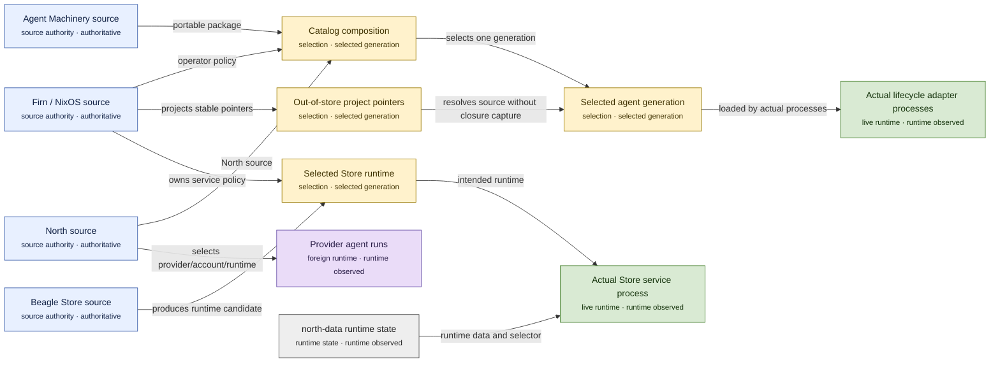
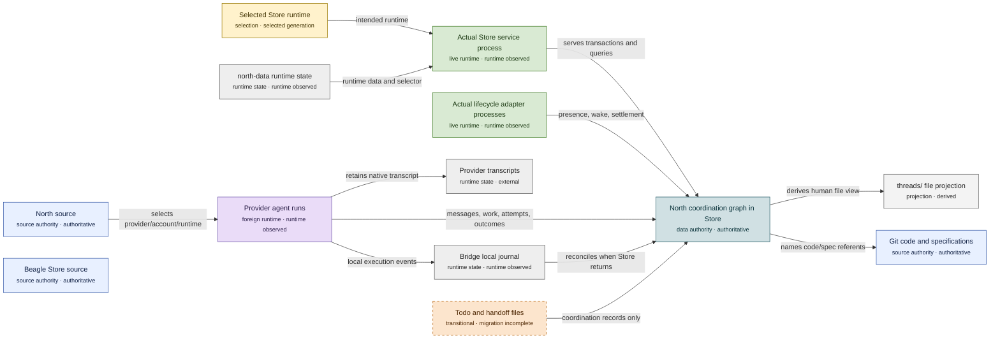
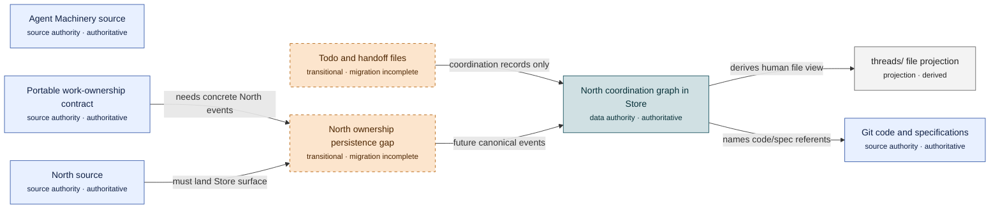

# North agent system

Generated from `north:architecture/system.edn` by the typed `north:cli/architecture-cli.bclj` authority. Do not edit this file directly.

Agent Machinery owns portable run design, North owns concrete coordination and runtime admission, Beagle Store owns durable domain-neutral facts, and Firn/NixOS owns machine activation without putting high-churn project source into the system closure.

Source authority states what should exist. A selected generation states what activation resolved. A live runtime states what an actual process loaded. None is proof of either other layer; inspect runtime identity separately when diagnosing skew.

Git remains authority for code and specifications. Store is authority only for coordination referents and events. `threads/` is a derived projection, while todo and handoff files remain transitional recovery state until their work is linked to canonical North identities.

## Legend

| Layer | Meaning |
|---|---|
| source authority | The repository that owns semantics and policy. |
| selection | A generation or runtime chosen for one activation. |
| live runtime | The process actually executing; inspect it rather than inferring it. |
| data authority | Canonical durable coordination state. |
| projection | Regenerable human or tool view. |
| transitional | Recovery state or an explicit migration gap. |
| foreign runtime | Provider-owned execution boundary. |
| runtime state | Local or provider state that is not source authority. |

## Ownership

Which source owns each decision and which runtime merely executes it.

```mermaid
flowchart LR
  %% Which source owns each decision and which runtime merely executes it.
  n_agent_machinery_source["Agent Machinery source<br/><small>source authority · authoritative</small>"]:::source_authority
  n_north_source["North source<br/><small>source authority · authoritative</small>"]:::source_authority
  n_beagle_store_source["Beagle Store source<br/><small>source authority · authoritative</small>"]:::source_authority
  n_firn_nixos_source["Firn / NixOS source<br/><small>source authority · authoritative</small>"]:::source_authority
  n_git_specifications["Git code and specifications<br/><small>source authority · authoritative</small>"]:::source_authority
  n_catalog_composition["Catalog composition<br/><small>selection · selected generation</small>"]:::selection
  n_active_agent_generation["Selected agent generation<br/><small>selection · selected generation</small>"]:::selection
  n_out_of_store_project_pointers["Out-of-store project pointers<br/><small>selection · selected generation</small>"]:::selection
  n_store_runtime_selection["Selected Store runtime<br/><small>selection · selected generation</small>"]:::selection
  n_lifecycle_adapters["Actual lifecycle adapter processes<br/><small>live runtime · runtime observed</small>"]:::live_runtime
  n_live_store_process["Actual Store service process<br/><small>live runtime · runtime observed</small>"]:::live_runtime
  n_provider_runs["Provider agent runs<br/><small>foreign runtime · runtime observed</small>"]:::foreign_runtime
  n_provider_transcripts["Provider transcripts<br/><small>runtime state · external</small>"]:::runtime_state
  n_coordination_graph["North coordination graph in Store<br/><small>data authority · authoritative</small>"]:::data_authority
  n_bridge_journal["Bridge local journal<br/><small>runtime state · runtime observed</small>"]:::runtime_state
  n_threads_projection["threads/ file projection<br/><small>projection · derived</small>"]:::projection
  n_todo_handoffs["Todo and handoff files<br/><small>transitional · migration incomplete</small>"]:::transitional
  n_north_runtime_state["north-data runtime state<br/><small>runtime state · runtime observed</small>"]:::runtime_state
  n_work_ownership_contract["Portable work-ownership contract<br/><small>source authority · authoritative</small>"]:::source_authority
  n_ownership_persistence_gap["North ownership persistence gap<br/><small>transitional · migration incomplete</small>"]:::transitional

  n_agent_machinery_source -->|portable package| n_catalog_composition
  n_north_source -->|North source| n_catalog_composition
  n_firn_nixos_source -->|operator policy| n_catalog_composition
  n_catalog_composition -->|selects one generation| n_active_agent_generation
  n_active_agent_generation -->|loaded by actual processes| n_lifecycle_adapters
  n_firn_nixos_source -->|projects stable pointers| n_out_of_store_project_pointers
  n_out_of_store_project_pointers -->|resolves source without closure capture| n_active_agent_generation
  n_beagle_store_source -->|produces runtime candidate| n_store_runtime_selection
  n_firn_nixos_source -->|owns service policy| n_store_runtime_selection
  n_store_runtime_selection -->|intended runtime| n_live_store_process
  n_north_source -->|selects provider/account/runtime| n_provider_runs
  n_provider_runs -->|retains native transcript| n_provider_transcripts
  n_live_store_process -->|serves transactions and queries| n_coordination_graph
  n_lifecycle_adapters -->|presence, wake, settlement| n_coordination_graph
  n_provider_runs -->|messages, work, attempts, outcomes| n_coordination_graph
  n_provider_runs -->|local execution events| n_bridge_journal
  n_bridge_journal -->|reconciles when Store returns| n_coordination_graph
  n_coordination_graph -->|derives human file view| n_threads_projection
  n_coordination_graph -->|names code/spec referents| n_git_specifications
  n_todo_handoffs -->|coordination records only| n_coordination_graph
  n_north_runtime_state -->|runtime data and selector| n_live_store_process
  n_work_ownership_contract -->|needs concrete North events| n_ownership_persistence_gap
  n_north_source -->|must land Store surface| n_ownership_persistence_gap
  n_ownership_persistence_gap -->|future canonical events| n_coordination_graph

  classDef source_authority fill:#e8f0ff,stroke:#3559a8,color:#102044
  classDef selection fill:#fff2cc,stroke:#9b7a00,color:#3f3100
  classDef live_runtime fill:#d9ead3,stroke:#38761d,color:#15330c
  classDef data_authority fill:#d0e0e3,stroke:#134f5c,color:#073038
  classDef projection fill:#f3f3f3,stroke:#666,color:#222
  classDef transitional fill:#fce5cd,stroke:#b45f06,color:#4c2500,stroke-dasharray: 5 5
  classDef foreign_runtime fill:#eadcf8,stroke:#674ea7,color:#271b45
  classDef runtime_state fill:#eeeeee,stroke:#555,color:#222
```

## Activation

How source authority becomes a selected generation and then an actually running process.

## Coordination

How agents exchange durable work state, messages, evidence, and local execution records.

## Migration

What is already Store-backed, what remains a file projection, and what is still transitional.

## Component inventory

| ID | Component | Layer | State | Owner | Responsibility | Failure effect | Evidence |
|---|---|---|---|---|---|---|---|
| `agent-machinery-source` | Agent Machinery source | source authority | authoritative | agent-machinery | Portable doctrine, roles, compositions, routing contracts, work-ownership contracts, and reusable skills. | Existing activated generations keep running, but new portable policy and run designs cannot be rebuilt from authority. | `agent-machinery:doctrine.md` `agent-machinery:catalog.json` `agent-machinery:contracts/work-ownership.schema.json` |
| `north-source` | North source | source authority | authoritative | north | Catalog composition, concrete run admission, provider/account/runtime selection, messages, threads, supervision, settlement, and coordination projections. | Current processes may continue, but coordination behavior and runtime admission cannot be changed or regenerated. | `north:AGENTS.md` `north:agent-catalog/sources.json` `north:src/north/main.bclj` `north:sdk/src/providers` |
| `beagle-store-source` | Beagle Store source | source authority | authoritative | beagle | Domain-neutral terms and triples, transactions, history, indexes, snapshots, query evaluation, and Store RPC semantics. | The selected Store can keep serving, but Store semantics and runtime artifacts cannot be repaired or advanced. | `beagle:store/AGENTS.md` `beagle:store/src/database.bclj` `beagle:store/src/store/rpc.bclj` |
| `firn-nixos-source` | Firn / NixOS source | source authority | authoritative | nixos-config | Machine and operator policy, services, resource limits, stable launchers, and out-of-store discovery pointers. | Already running processes and project worktrees remain, but machine activation, stable launchers, and policy projection cannot be updated. | `nixos-config:modules/north-profile/default.bnix` `nixos-config:modules/north-store/default.bnix` `nixos-config:dotfiles/agents/catalog-config.json` |
| `git-specifications` | Git code and specifications | source authority | authoritative | project repositories | Versioned code, specifications, schemas, and documents that remain Git authority rather than becoming Store payloads. | Coordination referents may survive, but their authoritative code and specification targets are unavailable. | `north:AGENTS.md` `agent-machinery:doctrine.md` |
| `catalog-composition` | Catalog composition | selection | selected generation | north | Compose North source, the Agent Machinery package, and operator policy into one selected agent catalog generation. | New activations cannot resolve one coherent agent generation; an already selected generation is not thereby invalidated. | `north:agent-catalog/sources.json` `north:agent-catalog/north.json` |
| `active-agent-generation` | Selected agent generation | selection | selected generation | north activation | The resolved, immutable-for-one-activation projection consumed by launchers and provider sessions. | New sessions cannot consume the intended policy generation; existing live sessions retain whatever generation they actually loaded. | `nixos-config:dotfiles/agents/lib/north-agent-activation.sh` `north:agent-catalog/activation.schema.json` |
| `out-of-store-project-pointers` | Out-of-store project pointers | selection | selected generation | firn / nixos-config | Point stable machine launchers at mutable worktrees or explicit filesystem pins without copying Tom-owned high-churn projects into the Nix system closure. | Launchers cannot discover a project revision, but project source remains independently editable and recoverable on the filesystem. | `nixos-config:modules/north-profile/default.bnix` `nixos-config:dotfiles/bin/_firn-live-tool` |
| `store-runtime-selection` | Selected Store runtime | selection | selected generation | north activation | Name the Store runtime generation intended for the service without equating that selection with the process that is actually live. | A service restart cannot reliably select the intended Store artifact; the current live process may continue unchanged. | `north:src/north/store_runtime_manifest.bclj` `nixos-config:modules/north-store/north-store-publish-runtime` |
| `lifecycle-adapters` | Actual lifecycle adapter processes | live runtime | runtime observed | north | When activated, observe session lifecycle events and publish concrete North presence, wake, and settlement operations. | Portable policy still exists, but automatic session registration, renewal, wake, or terminal settlement for the affected adapter does not occur. | `north:bin/north-on-spawn` `north:bin/north-on-tooluse` `north:bin/north-on-stop` `north:bin/north-on-terminal` |
| `live-store-process` | Actual Store service process | live runtime | runtime observed | nixos-config service / Beagle runtime | Serve the concrete Store RPC listener and persist transactions using the artifact the process actually loaded. | Durable coordination reads and writes stop; Git source, provider transcripts, and the Bridge journal remain separate authorities. | `nixos-config:modules/north-store/north-store-launch` `north:cli/runtime-attestation.clj` |
| `provider-runs` | Provider agent runs | foreign runtime | runtime observed | provider runtimes | Execute individual admitted runs and retain provider-specific execution state and transcripts. | The affected run stops or becomes unreachable; already committed coordination facts remain in Store. | `north:sdk/src/providers` `north:sdk/src/spawn.ts` `north:sdk/src/dispatch.ts` |
| `provider-transcripts` | Provider transcripts | runtime state | external | provider runtimes | Retain provider-native conversation and rollout history; they are evidence sources, not North's coordination authority. | Provider-native history is unavailable even when North's committed coordination graph still exists. | `north:sdk/src/providers` |
| `coordination-graph` | North coordination graph in Store | data authority | authoritative | north domain over Beagle Store | Canonical messages, acknowledgements, threads, dependencies, run and attempt evidence, listener receipts, and outcomes. | Agents lose the durable shared coordination referent; local code, specifications, transcripts, and transitional files remain outside it. | `north:src/north/projections.bclj` `north:cli/msg-cli.clj` `north:cli/run-ledger.clj` |
| `bridge-journal` | Bridge local journal | runtime state | runtime observed | north bridge | Append and replay local execution events so the provider edge can survive a temporary Store outage. | Bridge-local replay history is unavailable; Store facts and provider transcripts are unaffected. | `north:sdk/src/bridge/journal.ts` `north:sdk/src/bridge/northd.ts` |
| `threads-projection` | threads/ file projection | projection | derived | north | Provide a human-readable file view derived from the coordination graph; never become coordination authority. | The file view can be regenerated; the canonical coordination graph is unchanged. | `north:AGENTS.md` |
| `todo-handoffs` | Todo and handoff files | transitional | migration incomplete | operator filesystem | Carry recovery and continuity for work not yet linked to canonical North coordination identities. | Unmigrated lanes may lose their only continuity record; Store-backed messages and threads are unaffected. | `/home/tom/code/todo` `north:AGENTS.md` |
| `north-runtime-state` | north-data runtime state | runtime state | runtime observed | north runtime | Hold generated activation state, service data, local databases, receipts, and runtime artifacts; never serve as source authority. | Live services and local recovery state may fail even though all Git source authorities remain intact. | `north:AGENTS.md` `north:cli/store-runtime-generation.bclj` |
| `work-ownership-contract` | Portable work-ownership contract | source authority | authoritative | agent-machinery | Define provider-independent acceptance, transfer, refusal, and escalation semantics for intentional actors. | Agents lack one portable ownership contract, while current North driver facts continue to describe only their narrower legacy relation. | `agent-machinery:contracts/work-ownership.schema.json` `agent-machinery:skills/work-ownership-distilled/SKILL.md` |
| `ownership-persistence-gap` | North ownership persistence gap | transitional | migration incomplete | north | Represent the not-yet-landed Store surface for portable work-ownership events without overloading title-bearing threads or driver. | Ownership transfer and acceptance may remain encoded in handoffs or overloaded thread facts instead of one canonical Store record. | `agent-machinery:contracts/work-ownership.schema.json` `north:cli/acquire-cli.clj` `north:cli/pred-cli.clj` |

## Relationship inventory

| ID | Edge | Meaning | Views | Failure effect | Evidence |
|---|---|---|---|---|---|
| `machinery-composes-catalog` | `agent-machinery-source` → `catalog-composition` | portable package | ownership, activation | The selected catalog loses portable roles, templates, and skills. | `north:agent-catalog/sources.json` |
| `north-composes-catalog` | `north-source` → `catalog-composition` | North source | ownership, activation | The selected catalog loses North-owned activation and runtime modules. | `north:agent-catalog/sources.json` |
| `operator-configures-catalog` | `firn-nixos-source` → `catalog-composition` | operator policy | ownership, activation | Operator policy cannot constrain the selected catalog. | `north:agent-catalog/sources.json` `nixos-config:dotfiles/agents/catalog-config.json` |
| `catalog-generates-activation` | `catalog-composition` → `active-agent-generation` | selects one generation | ownership, activation | Launchers have no coherent selected policy generation. | `north:agent-catalog/activation.schema.json` |
| `generation-activates-adapters` | `active-agent-generation` → `lifecycle-adapters` | loaded by actual processes | ownership, activation | A selected generation exists but is not automatically applied to session lifecycle. | `nixos-config:dotfiles/agents/lib/north-agent-activation.sh` |
| `firn-project-pointers` | `firn-nixos-source` → `out-of-store-project-pointers` | projects stable pointers | ownership, activation | Machine launchers cannot discover mutable project source outside the closure. | `nixos-config:modules/north-profile/default.bnix` |
| `project-pointers-feed-generation` | `out-of-store-project-pointers` → `active-agent-generation` | resolves source without closure capture | ownership, activation | The generation may select a stale or absent filesystem project path. | `nixos-config:dotfiles/bin/_firn-live-tool` |
| `beagle-selects-store-runtime` | `beagle-store-source` → `store-runtime-selection` | produces runtime candidate | ownership, activation | No Store candidate can be selected for the service. | `beagle:store/nix/jvm-composite.bnix` `north:src/north/store_runtime_manifest.bclj` |
| `firn-configures-store-runtime` | `firn-nixos-source` → `store-runtime-selection` | owns service policy | ownership, activation | The Store candidate has no machine service policy or resource envelope. | `nixos-config:modules/north-store/default.bnix` |
| `selection-launches-store` | `store-runtime-selection` → `live-store-process` | intended runtime | ownership, activation, coordination | Selection and reality skew; runtime inspection must identify what is actually serving. | `nixos-config:modules/north-store/north-store-launch` `north:cli/runtime-attestation.clj` |
| `north-admits-provider-runs` | `north-source` → `provider-runs` | selects provider/account/runtime | ownership, activation, coordination | No new concrete run is admitted even though portable run designs still exist. | `north:sdk/src/spawn.ts` `north:sdk/src/dispatch.ts` |
| `provider-retains-transcript` | `provider-runs` → `provider-transcripts` | retains native transcript | ownership, coordination | The run may execute without recoverable provider-native history. | `north:sdk/src/providers` |
| `store-persists-graph` | `live-store-process` → `coordination-graph` | serves transactions and queries | ownership, coordination | The canonical coordination graph becomes unavailable to all participants. | `north:cli/store-rpc-client.clj` `beagle:store/src/store/rpc.bclj` |
| `adapters-record-lifecycle` | `lifecycle-adapters` → `coordination-graph` | presence, wake, settlement | ownership, coordination | The graph lacks automatic lifecycle observations for the affected session. | `north:bin/north-on-spawn` `north:bin/north-on-terminal` |
| `providers-coordinate-through-graph` | `provider-runs` → `coordination-graph` | messages, work, attempts, outcomes | ownership, coordination | Runs can continue locally but cannot share durable coordination state. | `north:cli/msg-cli.clj` `north:cli/run-ledger.clj` |
| `providers-record-bridge-journal` | `provider-runs` → `bridge-journal` | local execution events | ownership, coordination | A Store outage can also erase the Bridge's local replay path. | `north:sdk/src/bridge/journal.ts` |
| `bridge-replays-to-graph` | `bridge-journal` → `coordination-graph` | reconciles when Store returns | ownership, coordination | Local execution evidence remains stranded outside canonical coordination. | `north:sdk/src/bridge/journal.ts` `north:sdk/src/bridge/northd.ts` |
| `graph-projects-threads` | `coordination-graph` → `threads-projection` | derives human file view | ownership, coordination, migration | Humans lose a convenient file view; the graph remains canonical. | `north:AGENTS.md` |
| `graph-references-git` | `coordination-graph` → `git-specifications` | names code/spec referents | ownership, coordination, migration | Coordination records become detached from their authoritative code or specification. | `north:AGENTS.md` |
| `handoffs-migrate-to-graph` | `todo-handoffs` → `coordination-graph` | coordination records only | ownership, coordination, migration | Unlinked work remains dependent on file discovery and manual wake-up. | `north:AGENTS.md` `/home/tom/code/todo` |
| `north-state-hosts-store` | `north-runtime-state` → `live-store-process` | runtime data and selector | ownership, activation, coordination | The service loses its local data or selected-runtime state. | `north:cli/store-runtime-generation.bclj` |
| `ownership-contract-needs-persistence` | `work-ownership-contract` → `ownership-persistence-gap` | needs concrete North events | ownership, migration | Portable ownership intent is not durably represented by North. | `agent-machinery:contracts/work-ownership.schema.json` `north:cli/acquire-cli.clj` |
| `north-owns-persistence-gap` | `north-source` → `ownership-persistence-gap` | must land Store surface | ownership, migration | The missing surface remains split across driver facts and file handoffs. | `north:AGENTS.md` `north:cli/pred-cli.clj` |
| `ownership-gap-migrates-to-graph` | `ownership-persistence-gap` → `coordination-graph` | future canonical events | ownership, migration | Ownership acceptance and transfer remain outside the canonical coordination graph. | `agent-machinery:contracts/work-ownership.schema.json` `north:cli/pred-cli.clj` |
