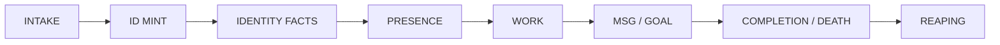
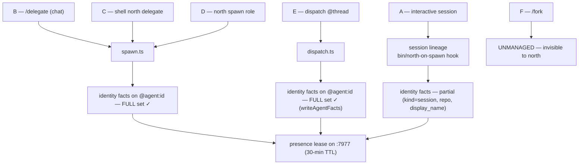
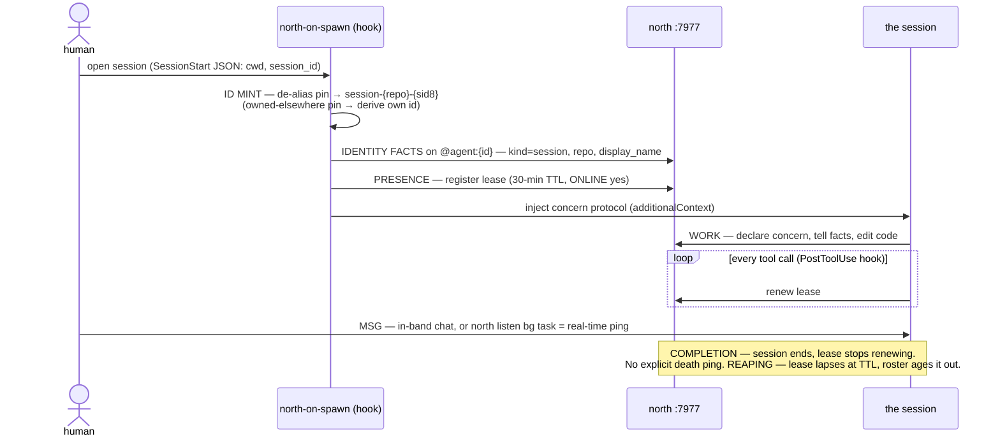
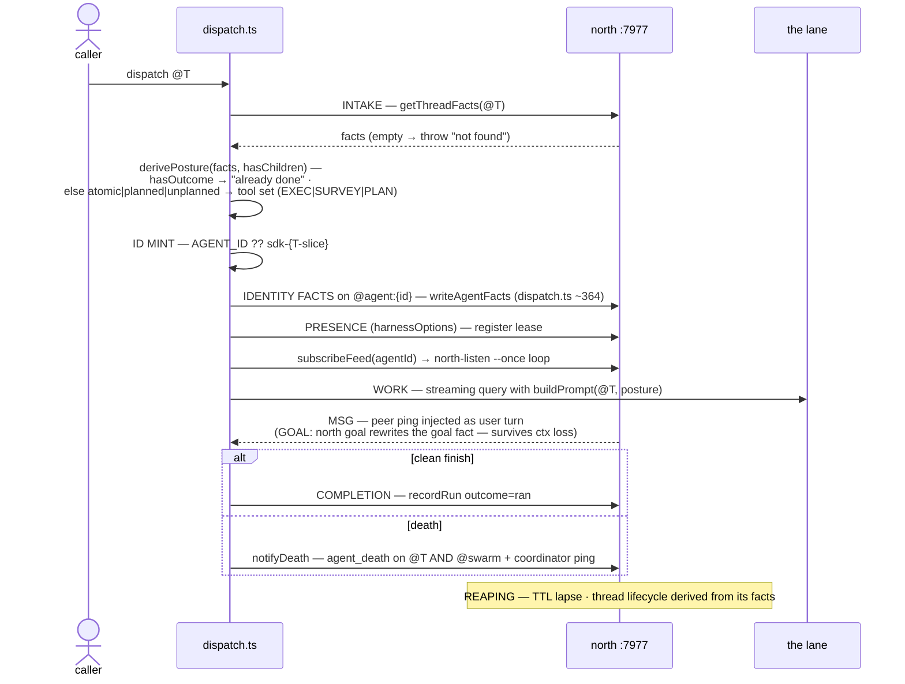
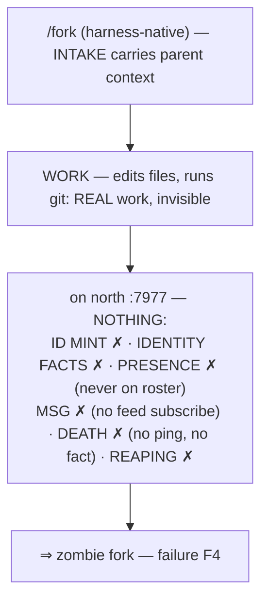
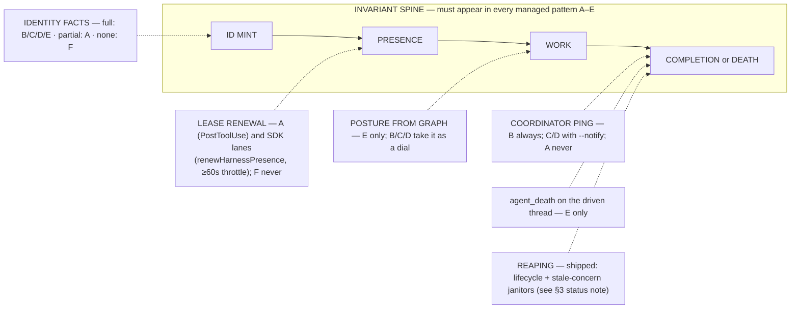
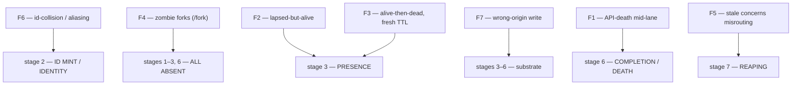

# The workflow map

*The definitive diagram-in-prose of the agentic stack's dispatch pipelines,
doubling as the pipeline-debug spec.*

> **Status (2026-07-30).** Moved here from the personal agent profile — this is
> a north repo reference doc, not steering. Grounded in source read 2026-07-09;
> since then the execution model went two-speed (2026-07-30, see `north:CLAUDE.md`),
> coordination-v2 lane V1 landed (see the §3 status note), and `north trace`
> shipped (`north:cli/trace-cli.clj`) implementing the §2/§4 playbook. The
> invariant-spine checklist (§2) and failure modes F1–F7 (§3–4) remain the
> operative debug spec.
>
> **Re-verified against source 2026-08-10.** `dispatch.ts` now writes identity
> facts, SDK lanes renew their leases, and reaping is shipped — §1/§2 were
> corrected accordingly and the `sdk/src` files this document actually describes
> were added to its docctl sidecar so the next such drift is detectable.

> **Naming.** The stack as a whole has no settled name yet; a naming pass is
> pending. Today the parts carry their own names and this doc uses them as
> found in source: **fram** (triple engine), **north** (coordination substrate),
> **orchestration** (staffing doctrine). The cockpit/dashboard folded into north
> (2026-07-10): `north dashboard` / `north doctor` / bare `north` (the card). Any of
> these names may change. Where this doc says "the stack" it means the whole;
> where it names a part it means that part's code as it exists on 2026-07-09.

This document is **grounded in source read on 2026-07-09**, not in memory.
Every claim below is either (a) traceable to a file cited inline, or (b)
explicitly flagged as an assumption. The companion audit
(`~/code/after-text/docs/private/lane-v3-report.md`) lists what was read and
what could not be verified from source.

---

## 0. Vocabulary (defined at first use)

| term | one-line definition |
|------|---------------------|
| **fact** | a *status* North's domain confers, never the name of the stored thing. North's coordination rows are performative — writing "this lease is held" constitutes the state it describes — so fact-hood is honest here. The stored unit is fram's recursive Triple (three neutral slots, any of which may hold another Triple) plus the occurrence that asserted or retracted it; subject/predicate/object is a domain reading, never kernel law (`fram:docs/ontology.md`) |
| **thread** | any `@id` that has a `title` fact — a unit of work or thought |
| **lane / agent / worker** | one spawned unit of execution (never "fleet") |
| **coordinator** | the agent that spawned a lane and receives its completion/death pings |
| **`@agent:<id>`** | the fact subject carrying a lane's *identity* (kind/role/model/effort/goal/display_name) |
| **`@swarm`** | the coordinator-visible roster node; where `budget_total` and `agent_death` facts land |
| **concern** | a declared work footprint (files + intent); a coordination signal, **not a lock** — declaring never blocks |
| **presence / lease** | a heartbeat registration on the `:7977` coordinator with a **30-min TTL**; renewed (in session agents) on tool use |
| **posture** | how a lane works (`explore` / `deliver` / `evaluate` / `preserve`); `evaluate` orders evidence quality, decision correctness, coverage, speed, then polish; derived from thread facts by `dispatch`, or passed on `spawn` |
| **template** | reusable defaults for a common input-to-deliverable shape, encoded as `composition.kind:"preset"` on the compatibility wire; never a mandatory worker identity |
| **function / role** | responsibility and deliverable; independent of task grade, domain requirements, topology, semantic tier, and deliberation |
| **task grade** | prior for the work's scope, autonomy, novelty, and integration responsibility — `novice` → `junior` → `mid` → `senior` (capability), then `staff` → `principal` → `distinguished` (scope/influence) (`orchestration/docs/task-grades.md`); not a model identity |
| **semantic tier** | provider-neutral model capability floor (`economy` / `standard` / `senior` / `frontier`) |
| **coordination workers** | independently supervised processes for rebuild coordination, durable reconciliation, projection, and bounded scheduled maintenance |

**The two writer origins.** Port `:7978` was once a stranded coordination
writer, which caused the historical §3 F7 incident. It is now deliberately the
telemetry origin; `:7980` remains retired.

| port | role |
|------|------|
| `:7977` | **coordination** — threads, roster, concerns, board, mail, and presence |
| `:7978` | **telemetry** — runs, sessions, measurements, and guard-denial events |

---

## 1. THE WORKFLOW PATTERNS

Six ways work becomes a running lane. Each is drawn as a sequence diagram over
the same lifecycle spine:



Two spawn *lineages* underlie all six. Knowing which lineage a pattern rides
tells you which facts to expect:

- **SDK-lane lineage** — `sdk/src/spawn.ts` (ad-hoc prompt) or
  `sdk/src/dispatch.ts` (thread-driven). Both call `harnessOptions()`, which
  calls `registerPresence()` (`harness.ts:398`, wired at `harness.ts:2068`).
  **Both also call `writeAgentFacts()`** — `spawn.ts` (import ~91, call ~549)
  and `dispatch.ts` (import ~39, call ~364) — so a dispatched lane registers
  presence *and* writes `@agent:<id>` identity facts. This symmetry is new:
  through 2026-07 `dispatch.ts` did not import `writeAgentFacts`, and §3's
  identity/legibility framing was written against that older asymmetry.
- **Session lineage** — a Claude Code session. The `bin/north-on-spawn`
  SessionStart/SubagentSessionStart hook registers presence and writes three
  identity facts (`kind=session`, `repo`, `display_name`), then injects the
  concern protocol via `additionalContext`.

`mcp__north__spawn` and `mcp__north__dispatch` are the MCP tool faces of the SDK
lineage (the tool surface is assembled in `harness.ts`; the old `NATIVE_TOOLS`
symbol is gone). The CLI faces are
`north spawn` / `north delegate` (in `cli/agents-cli.clj`), which resolve orchestration
dials and then `bun run sdk/src/spawn.ts`.



> **`command_peer` — the decentralized initiator.** Any of patterns B–E can be
> *started by a peer instead of a human*, with no human relay. `command_peer`
> (`harness.ts:170` `sendPeerCommand`, tool `mcp__north-peer__command_peer`)
> shells to `msg-cli send-cmd`, which asserts a command as facts on `@cmd:<id>`;
> the target's command consumer triggers on the `target` routing key and runs
> the op. The `PeerOperation` type still spans {spawn, dispatch, tell, acquire}
> (`harness.ts:129`), but `spawn` and `dispatch` currently **throw** — they are
> gated until atomic command claim and child reconciliation land, so only `tell`
> and `acquire` reach a target today.

---

### Pattern A — interactive session work

**Trigger:** a human opens a Claude Code session in a repo.
**Lineage:** session (`bin/north-on-spawn`).



Notes: a session mints its id **itself** in the hook, de-aliasing an inherited
`NORTH_AGENT_ID` pin (§3 id-collision). It has no `coordinator`, so there is **no
AGENT COMPLETE / AGENT DEATH ping** — its end is observed only as the lease
lapsing. Renewal is real here: the Claude-Code **PostToolUse hook** renews the
30-min lease on tool calls (`presence-cli.clj:21`), so `EXPIRES` tracks
activity.

---

### Pattern B — `/delegate` (chat)

**Trigger:** a human types `/delegate <text> [--new]` (`commands/delegate.md`).
**Lineage:** the slash command is an intelligent adapter over `north delegate`.
It classifies dependency shape once: atomic work selects an exact stock
template, an explicit template override, or a bespoke composition for its
terminal Orchestration worker; composite work alone selects the director.
North then selects the provider, account, concrete model, and runtime control.
Carrying context is BINARY (y/n), a trailing flag not a separate verb: bare =
this session's concise context brief rides along by default; `--new` = a clean
lane with a self-contained task. (Merges the retired `/request` + `/offload`.)

```mermaid
sequenceDiagram
    actor H as human
    participant R as /delegate (classifier)
    participant CLI as north delegate
    participant SP as spawn.ts
    participant T as north :7977
    participant CO as coordinator inbox
    H->>R: /delegate X [--new]
    R->>R: CLASSIFY dependency shape + terminal role/composition if atomic
    alt atomic
        R->>CLI: X --role worker [overrides or bespoke contract]<br/>+ context brief (default) or clean X (--new)
        CLI->>SP: one complete worker-topology Orchestration request
    else composite
        R->>CLI: X --composite<br/>+ context brief (default) or clean X (--new)
        CLI->>SP: canonical director Orchestration request
    end
    SP->>SP: FILTER capabilities/auth/usage → resolve provider/account/model
    SP->>SP: ID MINT — collision-safe lane id
    SP->>T: IDENTITY FACTS — requested composition +<br/>resolved provider/account/model/reasoning + goal/handle
    SP->>T: PRESENCE (harnessOptions) — register lease
    CLI-->>R: id + north watch {id}
    Note over H,R: END TURN — the human never waits
    alt atomic work
        SP->>SP: WORK — terminal worker executes directly; no agent spawning
    else composite work
        SP->>SP: WORK — director staffs worker lanes and owns reduction;<br/>director never executes a worker subtask
    end
    T-->>SP: MSG — peer ping (subscribeFeed) injected as user turn, no re-arm
    alt clean finish
        SP->>T: COMPLETION — recordRun outcome=ran
        SP->>CO: "AGENT COMPLETE" ping (outcome=ran)
    else on throw (subprocess death)
        SP->>T: notifyDeath — agent_death fact on @swarm
        SP->>CO: "AGENT DEATH" ping
    end
    Note over T: REAPING — lease lapses at TTL
```

Notes: `/delegate` is a **thin intelligent adapter** — the human's turn performs
one bounded intake decision but no delegated work: classify atomic versus
composite, select a terminal role/composition only for atomic work, spawn once,
confirm once, end the turn. It never selects provider, account, or concrete
model from its current session. Allocation stays automatic unless an explicit
user/task provider or exceptional account pin is forwarded; concrete model
selection stays North-owned. The launched lane does not re-decide its topology:
an atomic worker executes directly; a composite director decomposes and
reduces. The coordinator hears back through one of two terminal signals:
`AGENT COMPLETE` on clean finish (`spawn.ts:147`) or `AGENT DEATH` on a caught
subprocess death (`death.ts`).

---

### Pattern C — shell `north delegate`

**Trigger:** `north delegate "<text>" (--role <worker-role> | --composite)
[--context <file>] [spawn options]` at a shell
(`agents-cli.clj:cmd-delegate`).
**Lineage:** identical to B after classification: `--role` launches one atomic
terminal worker (exact template, recorded template overrides, or a structured
bespoke composition); `--composite` alone hydrates the director. North refuses
an unclassified handoff and resolves provider/account/model after the
provider-neutral request. The shell has no conversation to summarize, so
context is attached explicitly with `--context <file>`.

```mermaid
sequenceDiagram
    actor SH as shell
    participant CLI as agents-cli cmd-delegate
    participant CS as cmd-spawn (dial table)
    participant SP as spawn.ts
    participant T as north :7977
    SH->>CLI: north delegate X (--role R | --composite) [--context f] [spawn options]
    CLI->>CLI: INTAKE — require exactly one classification;<br/>prepend optional CONTEXT BRIEF + mode-specific operating contract
    alt --role R (atomic)
        CLI->>CS: hydrate R + forwarded template overrides or bespoke contract
    else --composite
        CLI->>CS: hydrate canonical director request
    end
    CS->>CS: North allocation default → filter capabilities/auth/usage →<br/>resolve provider/account/model; mint collision-safe id
    CS->>SP: bun run spawn.ts (detached · log → ~/.local/state/north/agents/{id}.log)
    SP->>T: IDENTITY FACTS on @agent:{id}
    SP->>T: PRESENCE — register lease
    CS-->>SH: "spawned {id}" + "north watch {id}"
    Note over SP,T: WORK / MSG / COMPLETION / DEATH / REAPING — same tail as pattern B
```

Notes: same classification, context, allocation, completion/death, and reaping
contract as B. The difference is **intake surface only**: the intelligent chat
adapter derives `--role` versus `--composite`, while a shell caller states it.
The lane runs detached with its transcript at
`~/.local/state/north/agents/<id>.log` (watched by `north watch <id>`).

---

### Pattern D — `north spawn <role>`

**Trigger:** `north spawn <role> "<prompt>"` (or `mcp__north__spawn`). The
general single-lane path. Use a template when its responsibility, deliverable,
done criteria, report shape, and fixed topology/capability boundary fit; only
task grade, domains, tier, reasoning, or posture may be explicitly overridden
while those properties remain unchanged. Any topology/authority change — or a
different responsibility, deliverable, done criteria, report shape, or
capability boundary — requires a bespoke role, and that composition decision
is recorded.
**Lineage:** SDK-lane via `spawn.ts`.

```mermaid
sequenceDiagram
    actor CA as caller
    participant CS as cmd-spawn
    participant G as Orchestration catalog
    participant R as North resolver
    participant SP as spawn.ts
    participant T as north :7977
    CA->>CS: north spawn R "P" — INTAKE: role R, prompt P
    CS->>G: parse dial table (never fork the doctrine)
    G-->>CS: role, taskGrade, domainRequirements, topology,<br/>tier, reasoning, posture, composition
    CS->>R: full semantic request + provider/account preference
    R-->>CS: eligible provider/account + concrete model/control<br/>(capability/auth/usage filtered)
    CS->>CS: mint collision-safe id; preserve requested + resolved route
    opt --dry-run
        CS-->>CA: print id + display_name, STOP
    end
    CS->>SP: bun run spawn.ts
    SP->>T: IDENTITY FACTS on @agent:{id}
    SP->>T: PRESENCE — register lease
    CS-->>CA: id + north watch
    SP->>SP: WORK — escalate-not-kill ladder in-flight (AGENT_ESCALATE=1)
    T-->>SP: MSG — subscribeFeed injects pings
    SP->>T: COMPLETION / DEATH → coordinator
    Note over T: REAPING — TTL lapse
```

Notes: this is the surface orchestration's doctrine actually routes to under
`dispatch=managed`. Template resolution consumes Orchestration's canonical provider-neutral
contract in `north:orchestration/docs/routing.md`; this workflow map does not redefine
the axes or infer one from another. `north templates` renders the stock catalog
and its resolved routing defaults. Source gathering uses the `scout` template
(junior grade, economy tier); novel hypothesis/experiment work uses the
`scientist` template (staff grade, frontier tier — `catalog.json`). Optional
**escalate-not-kill**: with `AGENT_ESCALATE=1` a struggling lane climbs the
`LADDER` in-flight (`spawn.ts:88-106`) instead of dying at a turn cap.

---

### Pattern E — thread-driven dispatch

**Trigger:** `mcp__north__dispatch <thread>` (or `bun run dispatch.ts <id>`).
Work already lives as a thread; posture is *derived from its facts*.
**Lineage:** SDK-lane via `dispatch.ts` — full identity facts, same as `spawn.ts`.



Notes: dispatch is the only pattern that reads a **posture from the graph**
rather than taking it as a parameter. Its death path is richer — it writes an
`agent_death` fact on **both** the driven thread `@T` *and* `@swarm`
(`death.ts:deathCommands`), because the thread is the durable home of that
work. Identity is **no longer** the differentiator: `dispatch.ts` calls
`writeAgentFacts` (~line 364), so a dispatched lane carries `display_name` and
the rest of the `@agent:<id>` set on the roster. The roster-legibility gap the
coordination-v2 identity work (§3) targeted is closed for E.

---

### Pattern F — fork-with-context (`/fork`) — UNMANAGED

**Trigger:** `/fork` (context-carrying fork). **Not found in source** on
2026-07-09; treated as *unmanaged* per the task framing and the audit.
**Lineage:** none of the above.



Notes: this is the **hole in the map**. A `/fork` produces a real working actor
that touches the repo but appears in *none* of north's observable stages — no
id, no identity, no presence, no death signal. That is the direct cause of
"zombie forks" (§3). Bringing `/fork` onto the SDK-lane lineage (id mint +
identity + presence + death ping) is the obvious remedy but is **not
implemented today.**

> **Status note (2026-07-10, updated). Managed context-carrying handoff** is the
> default mode of the unified delegation verb: shell `north delegate
> "<task>" (--role <worker> | --composite) --context <file>`
> (`agents-cli.clj:cmd-delegate`) and slash
> `/delegate <task>` (`commands/delegate.md`, context by default) — a context-carrying
> handoff on the SDK-lane lineage (pattern C's contract + a prepended
> parent-context brief), so it gets the full invariant spine (id mint · identity
> facts · presence · completion/death ping). (The delegation surface unified
> 2026-07-10: the earlier `north fork` / `/offload` verbs merged into `delegate`,
> carrying context is now a binary trailing flag.)
> The harness-native `/fork` itself remains unmanaged (F4 still applies to it);
> `/delegate` is the managed alternative to reach for, not a shadow of the builtin
> — the native `/fork` is a `local-jsx` builtin, and `/delegate`'s distinct name
> avoids the same-named-command collision.

---

## 2. CONSTANT vs CONDITIONAL — the invariant spine

The pipeline-debug question is: *for a given pattern, which lifecycle stages
must I be able to observe, and which are pattern-specific?*



The same content as a table with two labelled columns:

| **INVARIANT SPINE** (must appear in every *managed* pattern A–E) | **CONDITIONAL** (pattern-specific) |
|---|---|
| **ID MINT** — an id exists on `:7977` | **IDENTITY FACTS full set** — `spawn.ts` (B/C/D) and `dispatch.ts` (E) both call `writeAgentFacts`; partial for sessions (A); `/fork` (F) writes none |
| **PRESENCE** — a lease registered on `:7977` | **LEASE RENEWAL** — session lineage (A) renews via PostToolUse; SDK lanes renew on tool activity through `renewHarnessPresence` (`harness.ts:1695`, called from `spawn.ts:797`, `dispatch.ts:563`, `providers/openai.ts`), same ≥60s throttle. Only `/fork` (F) never renews |
| **WORK** — a streaming query runs (or, for A, the session) | **POSTURE FROM GRAPH** — only E derives posture from thread facts; B/C/D take it as a dial |
| **COMPLETION or DEATH** — the run resolves (`recordRun` outcome, or session end) | **COORDINATOR PING** — only when `AGENT_COORDINATOR` is set (B always; C/D with `--notify`; E if env set). Sessions (A) never ping |
| — | **`agent_death` on the driven thread** — only E (dispatch knows `@T`); B/C/D write it on `@swarm` only |
| — | **ESCALATE-NOT-KILL** — only with `AGENT_ESCALATE=1` (spawn.ts) |
| — | **REAPING** — shipped: the lane-lifecycle and stale-concern janitors run in `cli/coordination-maintenance-task-host.clj`; see §3 |

> `/fork` (F) is deliberately **outside** the invariant spine: it satisfies
> *none* of it. That is precisely why it is a failure source, not a pattern you
> can debug with these commands.

### The invariant spine as a checklist

**A healthy managed lane (patterns A–E) shows these observable facts/events, in
order. Each line names the exact command to confirm it.** This IS the
pipeline-debug checklist and the spec skeleton for a future `north trace
<agent-id>`.

1. **ID exists on the roster.**
   `north agents` → the id appears in the live list.
   (Or `bb north:cli/presence-cli.clj 7977 presence` for the raw table.)

2. **Identity facts written** *(full for B/C/D and E; `kind=session`+repo for
   A; absent only for `/fork` (F), which is outside the spine).*
   `north show @agent:<id>` → expect `kind`, `role`, `model`, `effort`, `goal`,
   `display_name`, `spawned_at`.

3. **Presence lease held, ONLINE.**
   `north agents` → `ONLINE yes`, `EXPIRES <n>s` (not `lapsed`).
   Dashboard view: `north dashboard` → the **FLEET** pane lists the lane with
   its agent state (`running`/`quiet` = live) and work state
   (`cli/dashboard-render.clj`).

4. **Work is advancing.**
   `north watch <id>` → transcript tail moves.
   Footprint: `north:bin/concern ls <repo>` → the lane's concern is
   declared and `building`.

5. **Msg/goal lands** *(only if you sent one)*.
   Sent a ping: `bb north:cli/msg-cli.clj 7977 inbox <id>` → the message
   is listed (and, once seen, `thread <msg-id>` shows `acked_by`).
   Goal set: `north show @agent:<id>` → `goal` and `display_name` reflect the new
   task (`north goal` rewrites the fact — survives context loss).

6. **Completion or death signal fired.**
   Clean finish: `bb north:cli/msg-cli.clj 7977 inbox <coordinator>` →
   `AGENT COMPLETE outcome=ran`.
   Death: `north show @swarm` → an `agent_death` fact `"<id> | <reason> | <ts>"`;
   for dispatch (E) also `north show @<thread>`. Telemetry: the run's
   `outcome="died"`.

7. **Reaping.**
   Today: `north agents` → the id ages to `lapsed` / drops off after the 30-min
   TTL; `concern ls` may still show a stale `building` concern.
   The stale-concern janitor writes `abandoned-stale` after a building concern's
   owner has been lapsed for 24h; likely-to-land concerns remain recoverable.

---

## 3. FAILURE MODES observed in the field

Each is mapped to the **checklist stage** (§2) where it manifests. Field
evidence is cited from the coordination-v2 design thread
(`019f4418-bed5-7625-b2ad-41abb6518269`, census dated 2026-07-09) and from
code comments recording specific incidents. Occurrence counts attributed to the
task brief are flagged as such.



> **Status note (2026-07-09, after this map was written).** Coordination-v2
> lane V1 landed the same day (north `17b3e97`): STALE/HANDOFF concern rendering
> on owner-lapse, stale-concern janitor retirement after 24h (`abandoned-stale`), the ≥60s
> activity-heartbeat throttle (session lineage), and stuck-fork reaping (lane
> lapsed >30min with no `outcome` → `died-unreported`). The "specced" remedies
> in F2/F3/F5 below are now LIVE — except SDK-lane lease renewal, which still
> registers once and never renews (F2 remains real for SDK lanes).
>
> **Status note (2026-07-30).** SDK-lane lease renewal now exists too: `renewPresence`
> in `north:sdk/src/harness.ts` renews on tool activity under the same ≥60s throttle,
> wired through the harness PostToolUse hook and `renewHarnessPresence` in the
> spawn/dispatch/Codex activity loops, and a rejected renewal is logged loudly instead
> of swallowed. F2 is closed for SDK lanes.

| # | failure mode | stage | what actually happens | field evidence |
|---|--------------|-------|------------------------|----------------|
| F1 | **API-death mid-lane** | 6 (COMPLETION/DEATH) manifesting during 4 (WORK) | The SDK runs the turn in a subprocess; OOM SIGKILL / parent SIGTERM / idle "Transport is closed" makes the async generator throw `exitError`. The error boundary (`spawn.ts:132`, `dispatch.ts:98`) catches it → `outcome="died"` + `notifyDeath`. Partial result still returned (supervision, not fail-fast). | thread progress: "alive-then-dead (N lanes died…)"; brief cites **7+ occurrences 2026-07-08/09** *(count per brief)* |
| F2 | **lapsed-but-alive** | 3 (PRESENCE) | Lease TTL (30 min) expires while the lane is still working. SDK lanes used to register once and never renew, so a long lane went `lapsed` though alive and the roster read it as gone. **Closed 2026-07-30**: SDK lanes renew on tool activity (harness `renewPresence`, ≥60s throttle). | thread progress: "lapsed-but-alive (R1b committed after lapse)" |
| F3 | **alive-then-dead with fresh TTL** | 3 (PRESENCE) — inverse of F2 | The lane dies but its 30-min lease has not expired, so `north agents` still shows `ONLINE yes / <n>s`. If death was a hard SIGKILL that skipped the `finally`, even the death ping may be missing. | thread progress: "alive-then-dead (N lanes died with fresh TTL)" |
| F4 | **zombie forks** | 1–3, 6 ALL ABSENT | A `/fork` (pattern F) does real work with no id mint, no identity, no presence, no death ping — invisible to every observation command. | §1 pattern F; brief |
| F5 | **stale concerns misrouting** | 7 (REAPING absent) | A concern owned by a dead/lapsed agent stays `building`; `concern overlap` still counts it, so a live lane shapes its work around a footprint that will never land — or is routed off it. | thread census: "17 STALE-building from dead agents… stale concern misrouted lane X-E" |
| F6 | **id-collision / aliasing** | 2 (ID MINT) | An inherited `NORTH_AGENT_ID` pin (a parent's env leaking into a subagent — SubagentSessionStart fires with the subagent's own `session_id` but the parent's env) makes two live actors share one `@agent:<id>`: mail answered by the wrong actor; roster phantom flood. Guarded now by the de-alias logic in `north-on-spawn` (only the *first* acquirer keeps a pin). | `north-on-spawn` comments: 2026-07-03 `cc-fram-*` had 3 workstreams + mail to wrong actor; 2026-07-02 **188 `cc-after-text-*` ghosts** |
| F7 | **wrong-origin write** | 3–6 substrate | A coordination fact written to the telemetry origin, or telemetry written to coordination, can be accepted by a writer yet remain absent from the projection that owns that subject kind. The historical incident used a then-stranded `:7978`; today that port is intentionally telemetry-only. | Historical comments in `north-on-spawn`, `harness.ts`, and `concern-cli.clj` record the 2026-07-02 split-brain; the current split-origin contract is defined by the coordination/telemetry routing code. |

---

## 4. THE DEBUG PLAYBOOK — spec for `north trace <agent-id>`

For each failure mode: how it **presents** on the dashboard, the **one command
that confirms it**, and the **remedy**. A future `north trace <agent-id>` should
walk the §2 checklist for one id and flag the first stage that fails; the rows
below are its rule set.

### F1 — API-death mid-lane
- **Presents:** lane vanishes from `north watch`; may still show `ONLINE` briefly
  (→ F3); coordinator gets an `AGENT DEATH` ping.
- **Confirm:** `north show @swarm` → `agent_death` fact for the id; for a
  dispatched lane also `north show @<thread>`. Cross-check `outcome="died"` in
  telemetry.
- **Remedy:** re-dispatch the thread (`mcp__north__dispatch @T` is idempotent —
  `hasOutcome` short-circuits if it actually finished). For chronic deaths,
  enable **escalate-not-kill** (`AGENT_ESCALATE=1`) so struggle climbs the
  ladder instead of dying. Partial result was returned — read it before retry.

### F2 — lapsed-but-alive
- **Presents:** `north agents` shows `EXPIRES lapsed` but `north watch` transcript
  is still moving / commits still landing.
- **Confirm:** `north watch <id>` advances **after** the lease shows `lapsed`;
  or a `committed`/`reached` fact timestamped later than the lease expiry.
- **Remedy (LIVE, 2026-07-30):** the activity heartbeat renews on every tool call
  (≥60s throttle) for session lineage and SDK lanes alike, so TTL means
  *is-working* and expiry is a real death signal. A `lapsed` lane that is still
  moving now means the renewal itself is failing — check the lane's stderr for
  `[presence] … lease renewal FAILED`.

### F3 — alive-then-dead with fresh TTL
- **Presents:** `north agents` shows `ONLINE yes / <n>s` but nothing is
  happening; `north watch` is frozen.
- **Confirm:** transcript tail is stalled **and** an `agent_death` fact exists
  (`north show @swarm`) OR the run's `outcome="died"`. A frozen tail with a live
  lease and *no* death fact = hard SIGKILL that skipped `finally` (worst case).
- **Remedy (today):** trust the `agent_death`/`outcome` over the lease. **Remedy
  (specced):** activity-derived heartbeat (as F2) makes a stalled lease decay
  quickly; independent lifecycle and stale-concern janitors close the gap.

### F4 — zombie forks
- **Presents:** repo is changing (new commits, edited files) but the actor is on
  **no** roster and answers **no** mail.
- **Confirm:** `git log --oneline -5` / working-tree diff shows edits with **no
  matching id** in `north agents` and **no** `@agent:<id>` from `north show`.
- **Remedy (today):** none automatic — identify the fork by its edits and
  coordinate out-of-band. **Structural remedy:** put `/fork` on the SDK-lane
  lineage (id mint + `writeAgentFacts` + `registerPresence` + `notifyDeath`) so
  it enters the invariant spine.

### F5 — stale concerns misrouting
- **Presents:** `north:bin/concern ls <repo>` counts a repo's `building`
  concerns high, but the owners are not in `north dashboard`'s FLEET pane.
  (The dashboard has no concerns pane — its panes are FLEET · HEALTH · QUEUE ·
  ACCOUNTS; concern state is read through `concern ls`.)
- **Confirm:** `north:bin/concern ls <repo>` shows `building` concerns
  whose owner id is `lapsed`/absent in `north agents`.
- **Remedy (today):** manually `concern status <id> done`/abandon the orphan.
  **Remedy (specced, coordination-v2 item 1):** owner-presence-lapsed →
  concern renders `STALE` (pure projection, no write); `STALE >24h` → the
  stale-concern janitor writes an `abandoned-stale` fact; `likely-to-land`
  survives lapse as a recovery candidate.

### F6 — id-collision / aliasing
- **Presents:** one id on the roster with contradictory focus; a peer's reply
  arrives from the "wrong" actor; roster floods with near-duplicate ids.
- **Confirm:** `north show @agent:<id>` shows facts that cannot belong to one
  actor (two repos/goals racing); or `north agents` lists many
  `session-<repo>-*` phantoms.
- **Remedy:** already guarded — `north-on-spawn` honors a `NORTH_AGENT_ID` pin (legacy `TERN_AGENT_ID` accepted transitionally)
  **only** if no other session owns it (first-acquirer wins), else derives
  `session-<repo>-<sid8>`. If phantoms predate the guard, they age out at TTL.
  Never re-export a parent's `NORTH_AGENT_ID` into a child spawn.

### F7 — wrong-origin write
- **Presents:** a lane reports "told" / "committed" but `north show` / `north
  board` never reflect it; facts seem to vanish.
- **Confirm:** compare the subject kind with the destination origin.
  Coordination subjects belong on `:7977`; telemetry subjects belong on
  `:7978`. A port mismatch is not itself a defect—an origin mismatch is.
- **Remedy:** use North's typed write surface so its partition router selects
  the origin. Do not point generic coordination writers at the telemetry port
  or force telemetry into the coordination origin.

---

## Appendix — source index (what backs each claim)

| subsystem | file | what it establishes |
|-----------|------|---------------------|
| verb routing | `north:bin/north` | life/engine/agent verb split; `:7977` canonical; fail-closed `tell` resolve |
| SDK ad-hoc spawn | `north:sdk/src/spawn.ts` | id mint, `writeAgentFacts`, error boundary, escalate-not-kill, completion ping |
| thread dispatch | `north:sdk/src/dispatch.ts` | posture-from-facts, `writeAgentFacts` (~364), `subscribeFeed`, dual `agent_death` |
| real-time msg | `north:sdk/src/coordination.ts` | streaming-input channel, host-side `north-listen` re-arm |
| death signal | `north:sdk/src/death.ts` | `agent_death` fact (@swarm/thread) + coordinator ping; synchronous, swallowed |
| harness/presence | `north:sdk/src/harness.ts` | `registerPresence` / `renewHarnessPresence` (:7977), the MCP tool surface, `command_peer` server |
| identity facts | `north:sdk/src/identity.ts` | `@agent:<id>` predicate set + `display_name` render |
| session hook | `north:bin/north-on-spawn` | session id de-alias, presence, `kind=session` facts, concern-protocol inject |
| agent CLI | `north:cli/agents-cli.clj` | `spawn`/`req`/`agents`/`watch`/`msg`/`goal`, dial-table parse |
| presence/lease | `north:cli/presence-cli.clj` | 30-min TTL, `presence` projection, `slackers`, `pin` |
| mail/commands | `north:cli/msg-cli.clj` | `send`/`inbox`/`ack`/`send-cmd` (@cmd facts), derived inbox |
| listener | `north:cli/north-listen.clj` | dormant-until-pinged pub/sub; role-addressing |
| cockpit | `north:cli/dashboard-cli.clj` (`north dashboard`/`doctor`; bare `north` card in `bin/north`) | dashboard/doctor/profile; parse-don't-fork orchestration; ownership rule (folded from convoy 2026-07-10) |
| staffing | `north:orchestration/doctrine.md` + `docs/adapters/north.md` | shapes→squad, laws, canonical dial table |
| delegate intake | `nixos-config:dotfiles/claude/commands/delegate.md` | `/delegate` intelligent atomic/composite classifier (context is orthogonal) |
| coordination-v2 | thread `019f4418-bed5-7625-b2ad-41abb6518269` | census, failure receipts, the specced reaping fix plan |
```
